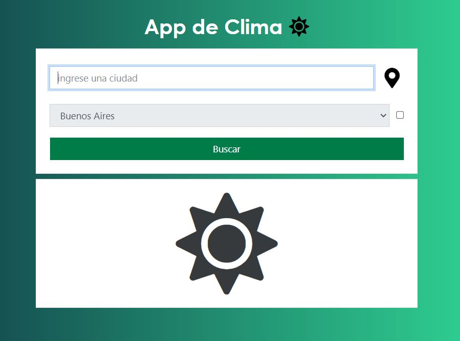
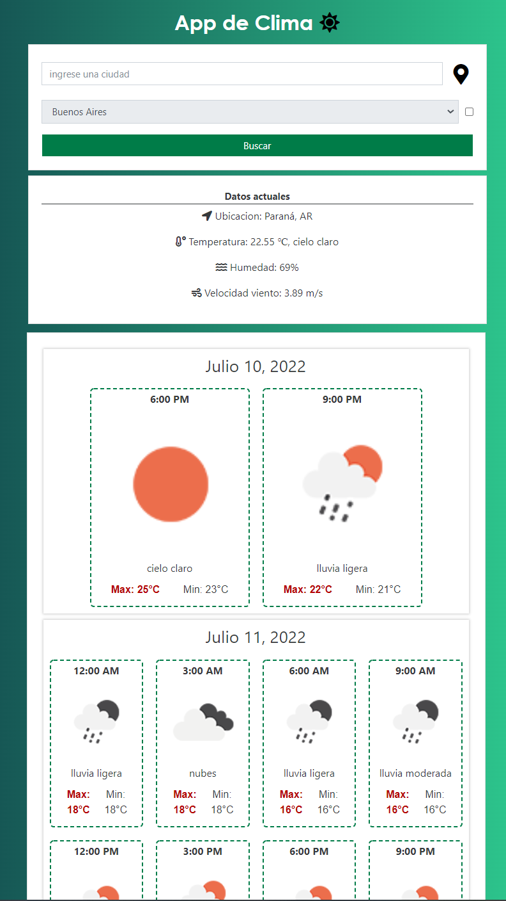

## React Weather Forecast (no Redux)

Aplicacion web para obtener la informacion actual y extendida por 5 dias de la ciudad seleccionada.

**API de la informacion**
5-day weather forecast SPA built on React. Styled with Sass. Uses the [5 Day / 3 Hour Forecast](https://openweathermap.org/forecast5/) Search by City API from [OpenWeatherMap](https://openweathermap.org/forecast5/).

**Demo**

**ScreenShot**

**Informacion del proyecto**
Este proyecto posee las librerias Prettier, Eslint, Axios, Babel, Testing, Jest, Sass

- Testeo
  Jest y Testing-react

- Optimizacion y validacion de codigo
  Prettier
  Babel
  Eslint

- Peticiones
  Axios

**Levantar Proyecto**
1 - npm install
2 - npm start
3 - http://localhost:8080

**Build**
1 - npm run build

**Formatear y validar codigo**
1 - npm run format
2 - npm run lint
